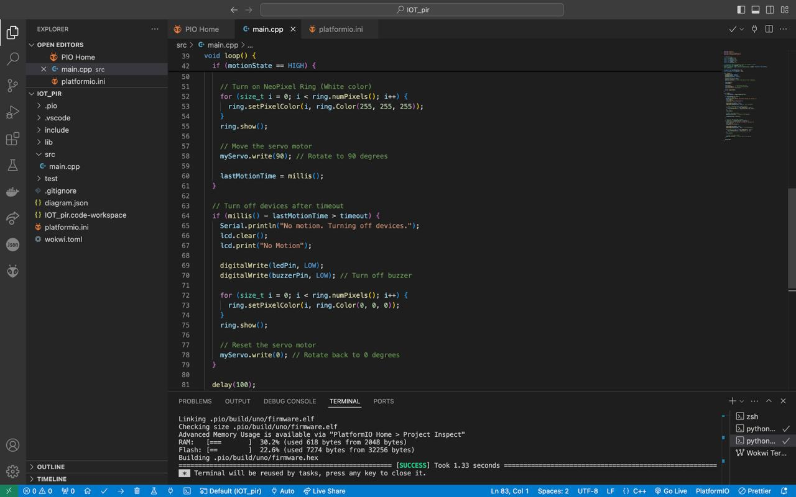
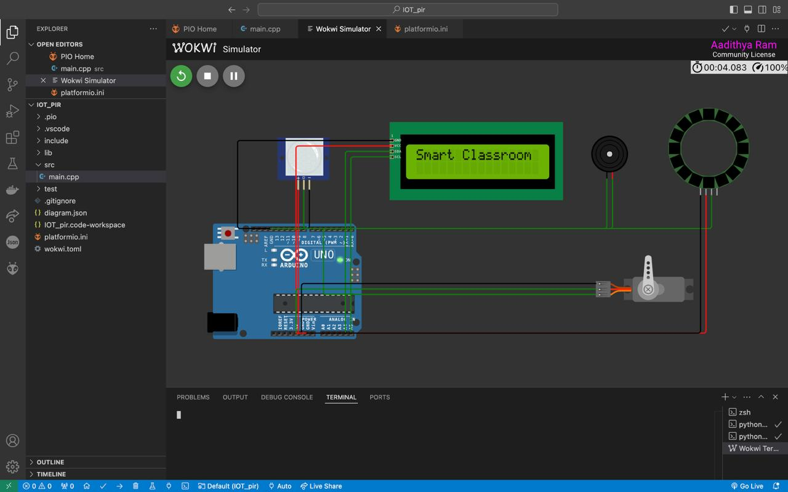
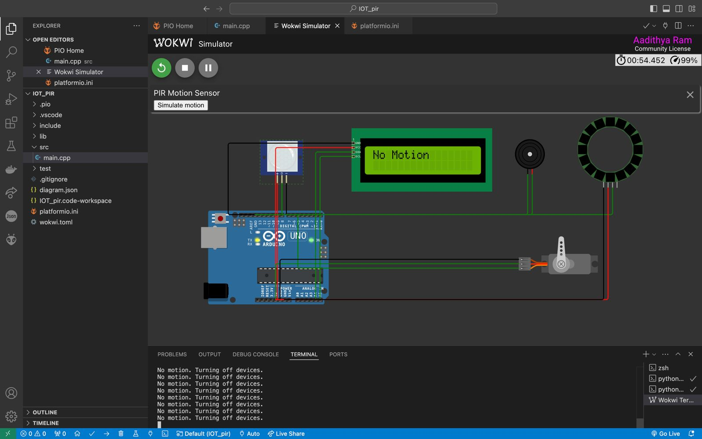
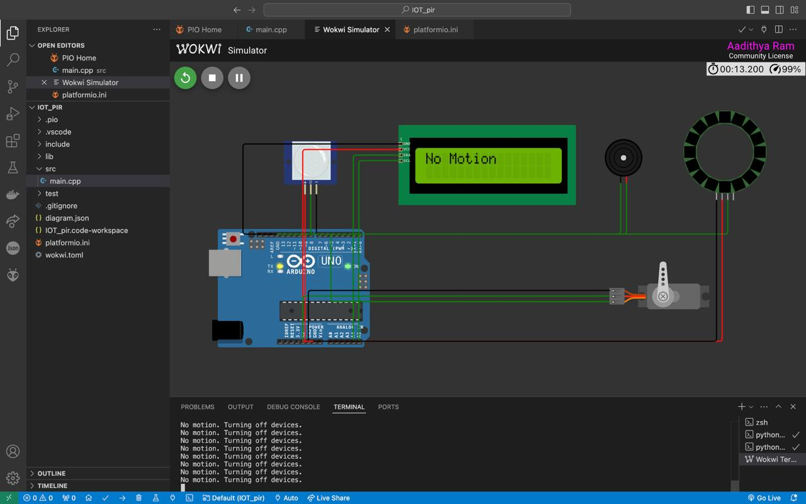
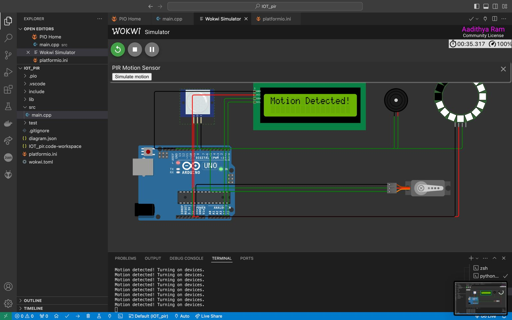

# 🎓 Smart Classroom Automation with PIR Sensor 🚀

An Arduino-based IoT project that automates smart classroom features like motion detection, automated LCD updates, and buzzer alerts. Developed using Wokwi Simulation, PlatformIO, and C++, this project combines multiple hardware components to create a fully interactive classroom system.

---

## 🧑‍💻 Developed By

- **Aadithya Ram**
  - [LinkedIn](https://linkedin.com/in/aadiithyyya)
  - [GitHub](https://github.com/Aadithya-4010002)

---

## 💡 Project Description

This project leverages motion sensors, a NeoPixel Ring, and an LCD display to create an automated smart classroom. When motion is detected, the system updates the LCD display, turns on a servo motor, and activates the NeoPixel Ring. After a timeout period with no motion, the system automatically turns off the devices, saving power.

---

## 🛠️ Features

- **Motion Detection**: Uses a PIR sensor to detect motion in the classroom.
- **LCD Display**: Displays messages like "Motion Detected" or "No Motion".
- **NeoPixel Ring Light**: Illuminates in response to motion detection.
- **Buzzer Alerts**: Activates on motion detection for immediate feedback.
- **Power Efficiency**: Automatically turns off all devices after a timeout.

---

## ⚙️ Components and Technologies

### Hardware
- **Arduino Uno**: The microcontroller powering the project.
- **16x2 I2C LCD Display**: Displays real-time system status.
- **PIR Sensor**: Detects motion in the classroom.
- **NeoPixel Ring Light**: Provides visual feedback for motion.
- **Buzzer/Speaker**: Alerts on motion detection.
- **5V Power Source**: Powers the components.

### Software
- **Wokwi Simulation IDE**: Virtual hardware simulation.
- **PlatformIO**: Development environment for Arduino.
- **VSCode Wokwi Extension**: Simplified simulation with a private license key.
- **C++**: Programming language used for the project logic.
- **Wokwi Simulation Configuration**: Customized setup for simulating the project.

---

## 🛠️ How It Works

1. **Motion Detection**:
   - The PIR sensor detects motion.
   - If motion is detected, the system activates:
     - **NeoPixel Ring** (white light illumination).
     - **LCD Display** (message: "Motion Detected").
     - **Buzzer/Speaker** (sound alert).

2. **Timeout Feature**:
   - If no motion is detected for a specific period (5 seconds in the code):
     - The system deactivates all components.
     - LCD Display shows "No Motion".
     - Servo motor resets to its initial position.

---

## 🖼️ Visuals

### Source Code in VSCode

### Circuit Design

### Simulation Environment

### No Motion Detected State

### Motion State

---

## 🛠️ Setup Instructions

1. **Open in PlatformIO**:
   - Install the [PlatformIO extension](https://platformio.org/) in VSCode.
   - Open the project folder in VSCode.

2. **Run Simulation**:
   - Use the Wokwi simulation settings.
   - Ensure all necessary libraries (`Adafruit NeoPixel`, `LiquidCrystal I2C`) are installed.

3. **Flash to Arduino**:
   - Connect your Arduino Uno to the system via USB.
   - Flash the code to the board using PlatformIO.

---

## 🤝 Acknowledgments

This project was made possible using the following tools and resources:

- **Wokwi**: A powerful virtual hardware simulation platform.
- **PlatformIO**: A versatile Arduino IDE alternative for embedded systems.
- **Adafruit NeoPixel Library**: For controlling RGB LED rings.
- **LiquidCrystal I2C Library**: For seamless communication with the I2C LCD display.
- **VSCode**: A modern code editor with an integrated development environment.

Special thanks to the open-source community for their valuable contributions and resources.

